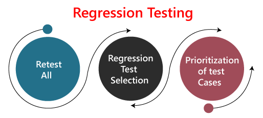

<h3>Regression Testing </h3>

Regression testing is a black box testing techniques. It is used to authenticate a code change in the software does not impact the existing functionality of the product. Regression testing is making sure that the product works fine with new functionality, bug fixes, or any change in the existing feature.

Regression testing is a type of software testing. Test cases are re-executed to check the previous functionality of the application is working fine, and the new changes have not produced any bugs.

Regression testing can be performed on a new build when there is a significant change in the original functionality. It ensures that the code still works even when the changes are occurring. Regression means Re-test those parts of the application, which are unchanged. 

**When can we perform Regression Testing?**

1. When new functionality added to the application.

    Example:
    ```
    A website has a login functionality which allows users to log in only with Email. Now providing a new feature to do login using Facebook.
    ```
2. When there is a Change Requirement.

    Example:
    ```
    Remember password removed from the login page which is applicable previously.
    ```
   
3. When the defect fixed.

    Example:
    ```
    Assume login button is not working in a login page and a tester reports a bug stating that 
    the login button is broken. Once the bug fixed by developers, tester tests it to make sure 
    Login Button is working as per the expected result. Simultaneously, tester tests other 
    functionality which is related to the login button.
    ```
   
4. When there is a performance issue fix

    Example:
    ```
    Loading of a home page takes 5 seconds, reducing the load time to 2 seconds.
    ```
   
5. When there is an environment change

    Example:
    ```
    When we update the database from MySql to Oracle.
    ```

**How to perform Regression Testing?**

Regression testing can be performed using the following techniques:

